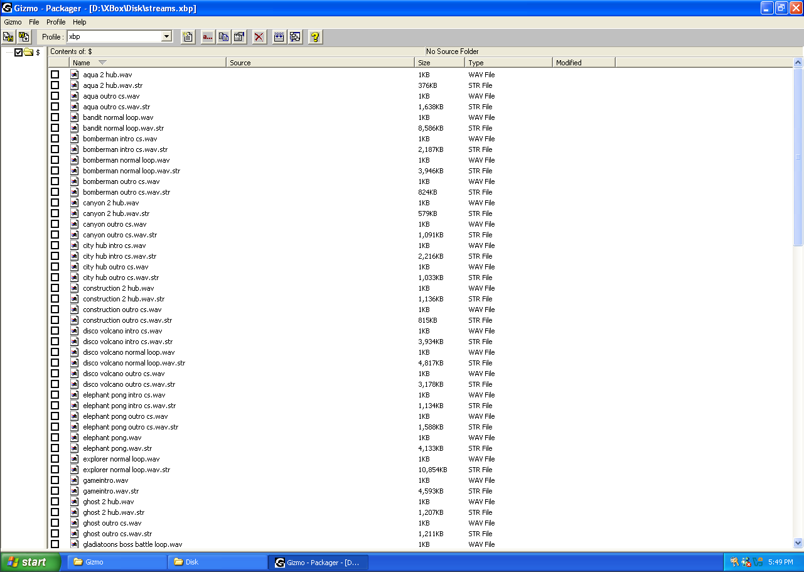
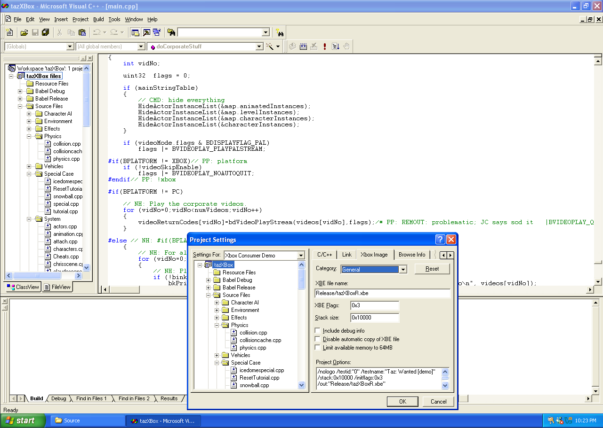
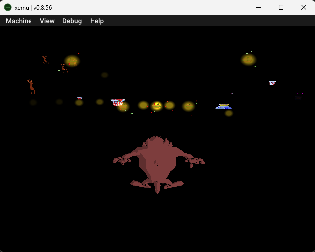
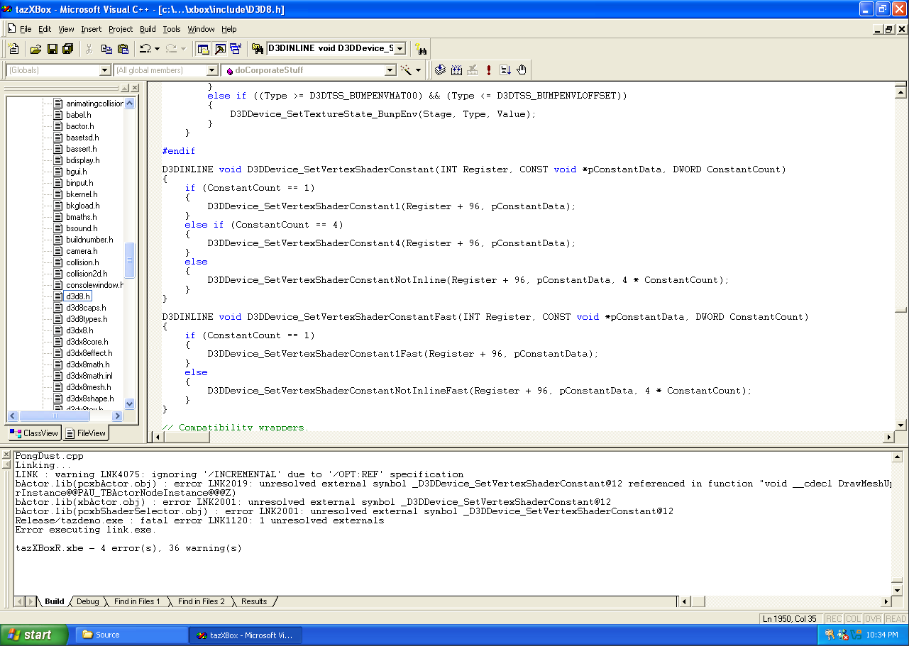

# Taz: Wanted Xbox Source Code
This repository doesn't include game packages, you need to have them from your game CD or download the original DVD with the game source code [here](https://archive.org/details/redump-id-123502).

## Gizmo
Gizmo is a universal tool used by the developers from Blitz Games to create/view archives, game files and so on.
This tool also contains all the plugins that will help you to view __source__ .obe files containing objects, animations, textures and so on.
Gizmo is not optimized for Windows 7+ systems. Use Windows 98/Windows 2000 compatibility mode or run it on a virtual machine.
Keep in mind that you probably won't have .obe file browsing working for you in this mode.

Check Packfiles.txt and Gizmo folder to build your own archives for the game (it won't give you a complete picture of how Gizmo works!)

## Taz (source code)
Check Building.txt for basic information about building the game (it won't give you a complete picture of creating your build!)
To compile the build you need to use:
- Windows no older than XP (Service Packs don't matter)
- - I won't be able to guarantee proper installation of the programs below on higher versions
- - Also I recommend using XP, as versions earlier than XP most often don't work well with emulators.
- Visual Studio 6 SP5
- Visual Studio 6 Processor Pack
- XDK 4432
- - We will talk about compatibility of other versions later.
 

### Download links:
- [Windows XP](http://old-dos.ru/index.php?page=files&mode=files&do=show&id=4404) (pick whatever .iso you want, I used the ninth one on the list)
- [Visual Studio 6](http://old-dos.ru/files/file_2693.html) (pick the first one)
- [Visual Studio 6 SP5 & Processor Pack upgrades](https://archive.org/details/vcpp5)
- XDK 4432 isn't available at the moment, pick from one of these instead:
- - [XDK Collection](https://archive.org/details/xbox-sdks) (you can choose between 4361 and 4627)

### Installing Visual Studio 6 and other related items
1. Install Windows XP on your virtual machine.
   - If you're using Virtual Box I recommend using .vhd hard disk instead of .vhi to easily access the contents of your disk via Daemon Tools Lite.
2. Install Visual Studio 6 first.
   - You don't need CD2 for installation, just quickly skip everything once the setup installed VS.
3. Install Visual Studio SP5.
4. Install Visual Studio Processor Pack.
5. Install XDK that you picked.

### Preparing Babel, Taz, etc.
1. Move Taz folder to whatever folder you want.
2. Now you have 2 ways:
   - Properly link Babel to Taz.
     
     or

   - Move everything from `Babel/Xbox/include` to `Taz/Source`.
3. Move the Babel folder to the folder previous to the Taz folder.
   - Here is an example of what you might get:

     Taz: `C/Documents and Settings/[username]/Desktop/[any folder]/Taz`
     
     Babel: `C/Documents and Settings/[username]/Desktop/Babel`
4. Remove mentions of binkxbox.lib everywhere inside tazXBox.dsw file.
5. Open tazXBox.dsw in `Taz/source`, click `Build -> Set Active Configuration...`, choose whatever you like.
6. Click Build -> Build .xbe.
7. After a while VS will ask you for a remote executable path and file name, ignore that, you already have your .xbe file.

### Creating your own Taz: Wanted Xbox iso
1. Download [extract-iso](https://github.com/XboxDev/extract-xiso)
2. Move the complied .xbe file to other game packages and rename it to Default.xbe
3. Launch extract-iso.exe with this command:
   `extract-iso.exe -c [path to your folder with Default.xbe and game archives] [path to your new .iso file and its name (if you want)]`

### XDK compatibility issues
1. XDK 4361
   - Builds perfectly, but after launching on Xbox can't work with splashes, objects and other stuff:

2. XDK 4627
   - Can't be built at the moment, optimized D3DDevice_SetVertexShaderConstant function in d3d8.h tricks the game code into thinking that it's not there.

&nbsp;

This README.md file will be updated with new information about the progress of researching game files, building code and game resources.